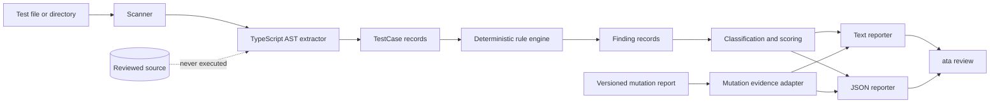

<strong>English</strong> · <a href="./zh/architecture.md">简体中文</a>

# Architecture

## Design constraints

- Source is parsed but never executed.
- Framework detection/extraction is separate from rule evaluation.
- Findings are immutable data with a public JSON shape.
- Future semantic, mutation, diff, and CI adapters must not silently alter deterministic output.

## Runtime flow

## Components

| Component | Responsibility | Boundary |
| --- | --- |
| `scanner` | Finds supported test filenames and skips generated/dependency directories. | Does not parse or execute source. |
| `extractor` | Uses TypeScript AST to extract direct `test` / `it` callbacks and their source location. | No module resolution or callback execution. |
| `rules/*` | Produces deterministic findings from a single `TestCase`. | Does not infer product intent. |
| `audit` | Aggregates rules, per-test classifications, FTR, and score. | Does not generate `STRONG`. |
| `mutation` | Validates an opt-in versioned mutation artifact and derives threshold status. | Does not run a mutation command or change static audit semantics. |
| `reporters` | Renders a human-readable text projection or the full structured JSON result. | Does not add findings. |
| `cli` | Parses the command, validates input, renders output, chooses documented exit code. | Does not impose a release policy beyond exit semantics. |

## Data contracts

`TestCase` preserves test name, file, framework, type, start line, callback source, and body. `Finding` preserves a stable ID, classification, severity, confidence, location, message, and remediation. An optional `MutationReport` preserves its engine label, recorded command, threshold and source, counts, score, and derived threshold status. `AuditResult` is the only reporter input and JSON output.

## Score model

`assessed = FAKE + WEAK + INVALID`; `FTR = fake / assessed × 100` when assessed is non-zero; `Trust Score = max(0, 100 - critical × 25 - warning × 10)`. This model counts findings, not test execution or defect-detection ability.

## Extensibility

Future work can add adapters for semantic review, mutation evidence, changed-file selection, and CI annotations behind distinct contracts. They must report their evidence source and must not upgrade an `UNASSESSED` deterministic result to `STRONG` without explicit, separately documented evidence.
