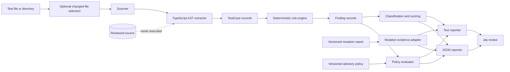

<strong>English</strong> · <a href="./zh/architecture.md">简体中文</a>

# Architecture

## Design constraints

- Source is parsed but never executed.
- Framework detection/extraction is separate from rule evaluation.
- Findings are immutable data with a public JSON shape.
- Future semantic, mutation, diff, and CI adapters must not silently alter deterministic output.

## Runtime flow

```mermaid
flowchart LR
  Input[Test file or directory] --> Selection[Optional changed-file selection]
  Selection --> Scanner[Scanner]
  Scanner --> Extractor[TypeScript AST extractor]
  Extractor --> Cases[TestCase records]
  Cases --> Rules[Deterministic rule engine]
  Rules --> Findings[Finding records]
  Findings --> Audit[Classification and scoring]
  Audit --> Text[Text reporter]
  Audit --> Json[JSON reporter]
  Mutation[Versioned mutation report] --> MutationAdapter[Mutation evidence adapter]
  MutationAdapter --> Text
  MutationAdapter --> Json
  Policy[Versioned advisory policy] --> PolicyAdapter[Policy evaluator]
  Findings --> PolicyAdapter
  PolicyAdapter --> Text
  PolicyAdapter --> Json
  Text --> CLI[ata review]
  Json --> CLI
  Source[(Reviewed source)] -. never executed .-> Extractor
```

## Components

| Component | Responsibility | Boundary |
| --- | --- |
| `scanner` | Finds supported test filenames and skips generated/dependency directories. | Does not parse or execute source. |
| `extractor` | Uses TypeScript AST to extract direct `test` / `it` callbacks and their source location. | No module resolution or callback execution. |
| `rules/*` | Produces deterministic findings from a single `TestCase`. | Does not infer product intent. |
| `audit` | Aggregates rules, per-test classifications, FTR, and score. | Does not generate `STRONG`. |
| `changed-files` | Selects current changed test files from a verified local commit. | Does not fetch, execute source, or infer test relevance. |
| `mutation` | Validates an opt-in versioned mutation artifact and derives threshold status. | Does not run a mutation command or change static audit semantics. |
| `policy` | Validates an opt-in advisory policy and counts findings selected by its disabled rule IDs. | Does not remove findings, change classifications/summary/exit semantics, create a CI gate, or make a release decision. |
| `baseline` | Validates an opt-in versioned baseline and counts current findings whose stable identities are historical. | Does not accept, remove, change, or suppress findings, scores, policy counts, or exit semantics. |
| `decision` | Validates a versioned static snapshot and projects an advisory decision. | Does not execute source, consume semantic/mutation evidence, create a CI gate, or alter `review`. |
| `gate-policy` | Validates an explicit `mode: "gate"` and `blockOn: ["FAKE"]` policy. | Does not alter advisory policy behavior. |
| `gate` | Produces a compact `GateResult` from a validated static snapshot. | FAKE-only gate; WEAK never blocks. |
| `reporters` | Renders a human-readable text projection or the full structured JSON result. | Does not add findings. |
| `cli` | Parses the command, validates input, renders output, chooses documented exit code. | Does not impose a release policy beyond exit semantics. |

`BenchmarkManifest` is a version `1` source-only contract consumed by `ata benchmark`. Its runner resolves relative fixture paths, calls the existing static `auditPath` pipeline, and compares exact rule/classification identities plus explicit non-triggers without importing or executing fixture source. `renderText` accepts `en` or `zh-CN`; `renderJson` keeps the existing structured schema.

`--policy <path>` supplies an advisory policy to the source-only audit. Invalid policy input exits `2`. The policy evaluator only reports disabled/active selection counts; it cannot remove findings, create a CI gate, or make a release decision.

`ata decision <envelope>` is an advisory decision adapter with valid exit code `0`; malformed envelopes exit `2` and produce no partial decision output.

`audit-reference.yml` projects changed-since audit JSON onto the strict `DecisionEnvelope` allowlist before invoking `decision`; audit-only metadata is not passed through.

## Data contracts

`TestCase` preserves test name, file, framework, type, start line, callback source, and body. Node test cases may also preserve statically declared `node:assert` bindings so direct named imports and namespace aliases can be recognized without module resolution or execution. `Finding` preserves a stable ID, classification, severity, confidence, location, message, and remediation. An optional `MutationReport` preserves its engine label, recorded command, threshold and source, counts, score, and derived threshold status. An optional `PolicyEvaluation` preserves the advisory policy identity, disabled rule IDs, and disabled/active finding counts. `AuditResult` is the only reporter input and JSON output.

## Score model

`assessed = FAKE + WEAK + INVALID`; `FTR = fake / assessed × 100` when assessed is non-zero; `Trust Score = max(0, 100 - critical × 25 - warning × 10)`. This model counts findings, not test execution or defect-detection ability.

## Extensibility

Future work can add adapters for CI annotations behind distinct contracts. They must report their evidence source and must not upgrade an `UNASSESSED` deterministic result to `STRONG` without explicit, separately documented evidence.
