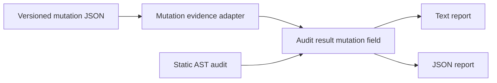

# AI Test Auditor v0.4 Mutation Evidence Design

## Goal

Add a local, offline mutation-evidence adapter. It loads a versioned JSON artifact produced by a user-run mutation tool and presents its result separately from deterministic static audit results.

## Scope

The public seam is `ata review <path> --mutation-report <path>`. The CLI reads the artifact; it does not execute the recorded command, import project code, install a mutation tool, or infer a mutation result.

The artifact is engine-neutral and has this version `1` shape:

```json
{
  "version": "1",
  "engine": "stryker",
  "command": "npx stryker run",
  "threshold": {
    "minimumScore": 80,
    "source": "stryker.conf.json: thresholds.high"
  },
  "result": { "totalMutants": 10, "killed": 8, "survived": 2, "score": 80 }
}
```

`engine`, `command`, and `threshold.source` are non-empty strings. `minimumScore` and `result.score` are percentages from 0 through 100. `totalMutants` is a positive integer, `killed` and `survived` are non-negative integers that sum to `totalMutants`, and the reported score must equal `killed / totalMutants * 100` within two decimal places. These constraints make the evidence self-contained and reproducible without treating any particular mutation engine as built in.

## Alternatives considered

1. **Generic offline artifact (selected).** Preserves local-first behavior and supports any tool that can export the stated evidence.
2. **Stryker-specific parser.** Would reduce initial mapping work but bind the public contract to one engine and its changing result format.
3. **Run a mutation command from the CLI.** Would execute user code and add runtime/environment risk that static auditing deliberately avoids.

## Architecture



The adapter owns parsing and validation. The CLI owns explicit opt-in through `--mutation-report`. Reporters display evidence in a dedicated advisory section. Static findings, classifications, FTR, Trust Score, and exit code remain unchanged whether or not an artifact is supplied or whether its score meets the recorded threshold.

## Error handling

Unreadable JSON, unsupported versions, missing provenance, invalid counts, or inconsistent score data fail the command through its existing input-error path. A valid artifact whose score is below `minimumScore` is still valid evidence and must not fail the command.

## Testing and acceptance

Tests exercise only public seams:

1. The mutation-report parser accepts a complete artifact and derives whether its score meets the recorded threshold.
2. The parser rejects missing provenance, inconsistent totals, and inconsistent scores.
3. CLI JSON output attaches valid mutation evidence while preserving static summary fields and exit code.
4. CLI rejects an invalid report through the established input-error behavior.
5. English and Chinese public documentation describe the schema, command provenance, threshold provenance, and non-gating boundary.

## Explicit non-goals

- Running mutation testing or recommending a specific mutation engine.
- Claiming runtime quality, test strength, mutation score targets, or production readiness.
- Using mutation evidence to mark tests `STRONG`, change a deterministic finding, change FTR/Trust Score, or enforce a quality gate.
