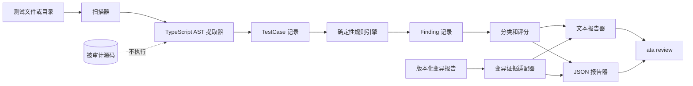

<a href="../architecture.md">English</a> · <strong>简体中文</strong>

# 架构设计

## 设计约束

- 解析源码但绝不执行。
- 框架识别/提取与规则评估分离。
- 发现项是不可变、具公开 JSON 形状的数据。
- 将来的语义、变异、diff、CI 适配器不能悄悄改变确定性输出。

## 运行流程

## 组件

| 组件        | 职责                                                      | 边界                                 |
| ----------- | --------------------------------------------------------- | ------------------------------------ |
| `scanner`   | 发现支持的测试文件名，跳过依赖和产物目录。                | 不解析、不执行源码。                 |
| `extractor` | 用 TypeScript AST 提取直接 `test` / `it` 回调及源码位置。 | 不解析模块依赖，不执行回调。         |
| `rules/*`   | 对单一 `TestCase` 生成确定性发现项。                      | 不推断产品意图。                     |
| `audit`     | 聚合规则、单测分类、FTR 和分数。                          | 不生成 `STRONG`。                    |
| `mutation`  | 校验显式 opt-in 的版本化变异产物并推导阈值状态。          | 不运行变异命令，不改变静态审计语义。 |
| `reporters` | 将同一结果渲染为文本或 JSON。                             | 不添加发现项。                       |
| `cli`       | 解析命令、校验输入、输出报告、选择退出码。                | 除退出码语义外不设发布策略。         |

## 数据契约

`TestCase` 保留名称、文件、框架、类型、起始行、回调源码和函数体。`Finding` 保留稳定 ID、分类、严重性、置信度、位置、信息和修复建议。可选 `MutationReport` 保留引擎标识、已记录命令、阈值及来源、数量、分数和推导出的阈值状态。`AuditResult` 是唯一报告输入与 JSON 输出。

## 评分

`assessed = FAKE + WEAK + INVALID`；当 assessed 非零时，`FTR = fake / assessed × 100`；`Trust Score = max(0, 100 - critical × 25 - warning × 10)`。该模型统计发现项，不统计测试执行或缺陷发现能力。

## 扩展

未来可增加语义评审、变异证据、变更文件选择和 CI 注释适配器，但必须分别披露证据来源；未经明确、单独文档化的证据，不得把确定性 `UNASSESSED` 升级为 `STRONG`。
