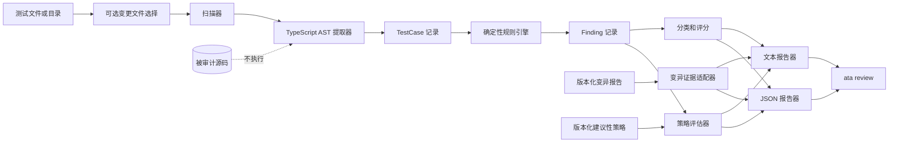

<a href="../architecture.md">English</a> · <strong>简体中文</strong>

# 架构设计

## 设计约束

- 解析源码但绝不执行。
- 框架识别/提取与规则评估分离。
- 发现项是不可变、具公开 JSON 形状的数据。
- 将来的语义、变异、diff、CI 适配器不能悄悄改变确定性输出。

## 运行流程

```mermaid
flowchart LR
  Input[测试文件或目录] --> Selection[可选变更文件选择]
  Selection --> Scanner[扫描器]
  Scanner --> Extractor[TypeScript AST 提取器]
  Extractor --> Cases[TestCase 记录]
  Cases --> Rules[确定性规则引擎]
  Rules --> Findings[Finding 记录]
  Findings --> Audit[分类和评分]
  Audit --> Text[文本报告器]
  Audit --> Json[JSON 报告器]
  Mutation[版本化变异报告] --> MutationAdapter[变异证据适配器]
  MutationAdapter --> Text
  MutationAdapter --> Json
  Policy[版本化建议性策略] --> PolicyAdapter[策略评估器]
  Findings --> PolicyAdapter
  PolicyAdapter --> Text
  PolicyAdapter --> Json
  Text --> CLI[ata review]
  Json --> CLI
  Source[(被审计源码)] -. 不执行 .-> Extractor
```

## 组件

| 组件            | 职责                                                                 | 边界                                                                           |
| --------------- | -------------------------------------------------------------------- | ------------------------------------------------------------------------------ |
| `scanner`       | 发现支持的测试文件名，跳过依赖和产物目录。                           | 不解析、不执行源码。                                                           |
| `extractor`     | 用 TypeScript AST 提取直接 `test` / `it` 回调及源码位置。            | 不解析模块依赖，不执行回调。                                                   |
| `rules/*`       | 对单一 `TestCase` 生成确定性发现项。                                 | 不推断产品意图。                                                               |
| `audit`         | 聚合规则、单测分类、FTR 和分数。                                     | 不生成 `STRONG`。                                                              |
| `changed-files` | 从已验证的本地提交选择当前变更的测试文件。                           | 不拉取、不执行源码、不推断测试关联性。                                         |
| `mutation`      | 校验显式 opt-in 的版本化变异产物并推导阈值状态。                     | 不运行变异命令，不改变静态审计语义。                                           |
| `policy`        | 校验显式 opt-in 的建议性策略，并统计其禁用规则 ID 选择的发现项。     | 不移除发现项，不改变分类/汇总/退出码，不创建 CI 门禁或发布决定。               |
| `baseline`      | 校验显式 opt-in 的版本化基线，并统计稳定身份属于历史项的本次发现项。 | 不接受、移除、改变或压制发现项、分数、策略计数或退出语义。                     |
| `decision`      | 校验版本化静态快照并投影建议性决策。                                 | 不执行源码、不消费 semantic/mutation 证据、不创建 CI 门禁，也不改变 `review`。 |
| `gate-policy`   | 校验显式 `mode: "gate"` 与 `blockOn: ["FAKE"]` 策略。                | 不改变 advisory 策略行为。                                                     |
| `gate`          | 从已校验静态快照生成紧凑 `GateResult`。                              | 仅 FAKE 门禁；WEAK 永不阻断。                                                  |
| `reporters`     | 将同一结果渲染为文本或 JSON。                                        | 不添加发现项。                                                                 |
| `cli`           | 解析命令、校验输入、输出报告、选择退出码。                           | 除退出码语义外不设发布策略。                                                   |

`BenchmarkManifest` 是 `ata benchmark` 使用的 version `1` 纯源码契约。runner 解析相对于 manifest 的 fixture 路径，调用现有静态 `auditPath` 管线，比对精确的 rule/classification 身份与明确的 non-triggers，不 import 或执行 fixture 源码。`renderText` 接受 `en` 或 `zh-CN`；`renderJson` 保持现有结构化 schema。

`--policy <path>` 为纯源码审计提供建议性策略。无效策略输入返回退出码 `2`。策略评估器只报告禁用/活跃选择计数；它不能移除发现项、创建 CI 门禁或作出发布决定。

`ata decision <envelope>` 是建议性决策适配器：有效调用返回 `0`；无效信封返回 `2`，且不输出部分决策。

`audit-reference.yml` 在调用 `decision` 前，将 changed-since 审计 JSON 投影到严格的 `DecisionEnvelope` 白名单；审计专用元数据不会透传。

## 数据契约

`TestCase` 保留名称、文件、框架、类型、起始行、回调源码和函数体。Node 测试还可以保留静态声明的 `node:assert` 绑定，使审计器无需模块解析或执行即可识别直接具名 import 和 namespace 别名。`Finding` 保留稳定 ID、分类、严重性、置信度、位置、信息和修复建议。可选 `MutationReport` 保留引擎标识、已记录命令、阈值及来源、数量、分数和推导出的阈值状态。可选 `PolicyEvaluation` 保留建议性策略标识、禁用规则 ID 和禁用/活跃发现项计数。`AuditResult` 是唯一报告输入与 JSON 输出。

## 评分

`assessed = FAKE + WEAK + INVALID`；当 assessed 非零时，`FTR = fake / assessed × 100`；`Trust Score = max(0, 100 - critical × 25 - warning × 10)`。该模型统计发现项，不统计测试执行或缺陷发现能力。

## 扩展

未来可增加语义评审、变异证据和 CI 注释适配器，但必须分别披露证据来源；未经明确、单独文档化的证据，不得把确定性 `UNASSESSED` 升级为 `STRONG`。
